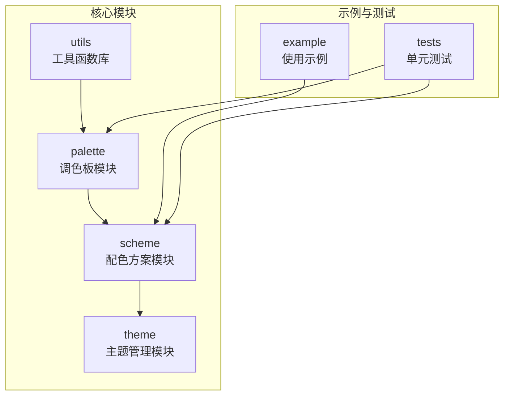
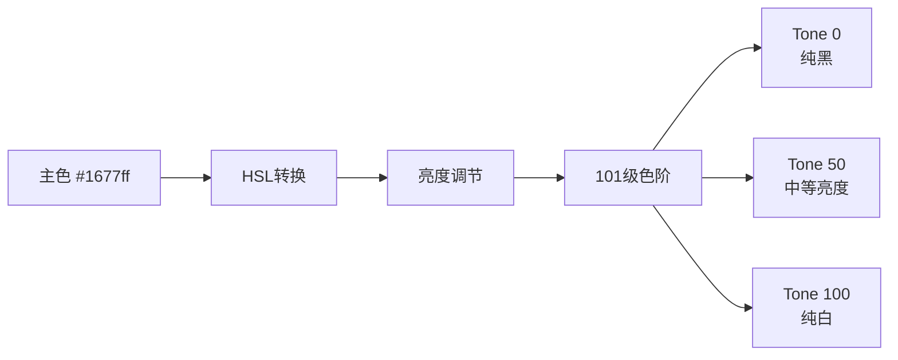
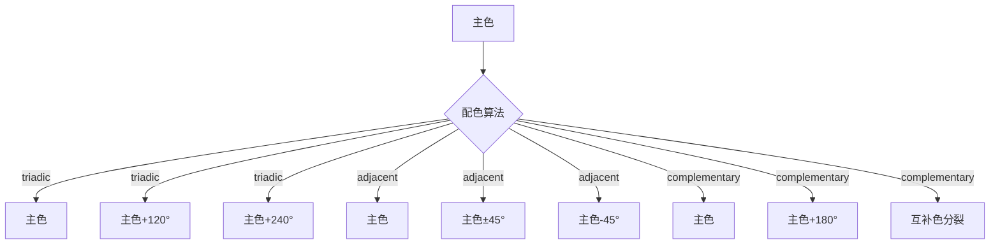

# @vi-design/color

@vi-design/color 是一个使用TypeScript编写的现代化配色方案库，旨在帮助开发者快速创建美观、一致且具有良好可访问性的主题配色方案。

## ✨ 核心特性

- **🎨 智能配色算法**: 基于色彩理论的科学配色生成，支持三分色、邻近色、互补色算法
- **🚀 多框架支持**: 支持Vue、Vitarx、UniApp等主流框架，提供一致的API体验
- **🌓 动态主题切换**: 支持亮色/暗色/系统模式无缝切换，自动同步视图更新
- **♿ 可访问性优化**: 自动优化对比度，确保符合WCAG 2.1标准
- **💪 TypeScript支持**: 完整的类型定义和智能提示，提升开发体验
- **📦 轻量级设计**: 小包体积，高性能，支持按需引入
- **🎯 101级色阶**: 精细的色阶控制，满足复杂设计需求
- **🖼️ 图片取色**: 支持从图片中提取主色调生成主题

## 📦 安装

```shell
# npm
npm install @vi-design/color

# pnpm
pnpm add @vi-design/color

# yarn
yarn add @vi-design/color
```

## 📖 在线文档

[📚 完整文档和主题生成器](https://color.visdev.cn/)

## 🏗️ 项目架构

项目采用模块化分层架构，清晰划分功能边界：



- **`src/palette`**: 调色板模块，负责基于单一颜色生成连续色阶
- **`src/scheme`**: 配色方案模块，构建完整的语义化颜色角色系统
- **`src/theme`**: 主题管理模块，实现框架集成与动态主题控制
- **`src/utils`**: 工具函数库，包含色彩转换、对比度计算等基础算法
- **`example/`**: 使用示例，涵盖配色生成、对比度测试等场景
- **`tests/`**: 单元测试，确保核心逻辑稳定性

## 🚀 快速开始

### 基础用法

```typescript
import { createWebTheme, Scheme, Palette } from '@vi-design/color'

// 1. 创建调色板 - 从单一颜色生成101级色阶
const palette = new Palette('#1677ff')
console.log(palette.tone(50)) // 获取50%亮度的色调

// 2. 创建配色方案 - 生成完整的语义化颜色系统
const scheme = new Scheme('#1677ff')
console.log(scheme.lightRoles.primary)    // 亮色模式主色
console.log(scheme.darkRoles.background)  // 暗色模式背景色

// 3. 创建主题 - 集成到应用中
const theme = createWebTheme('#1677ff')
console.log(theme.role('primary'))        // 获取当前主色
console.log(theme.cssVar('background'))   // 获取CSS变量：var(--color-background)
```

### 🖼️ 从图片提取颜色

```typescript
import { colorFromImageElement } from '@vi-design/color'

// 从图片元素提取主色调
const img = document.querySelector('img')
const dominantColor = await colorFromImageElement(img)
const theme = createWebTheme(dominantColor)
```

## 🔧 框架集成

### Vue 3 应用

**插件方式（推荐）：**

```typescript
// main.ts
import { theme } from '@vi-design/color/theme/vue'
import { createApp } from 'vue'
import App from './App.vue'

const app = createApp(App)
  .use(theme, {
    primaryColor: '#1677ff',
    customColor: {
      brand: '#ff5500'
    }
  })
  .mount('#app')
```

**模块化方式：**

```vue

<script setup>
  import { createVueTheme } from '@vi-design/color/theme/vue'
  import { ref, computed } from 'vue'

  const theme = createVueTheme('#1677ff')
  const isDark = ref(false)

  const currentRoles = computed(() =>
    isDark.value ? theme.scheme.darkRoles : theme.scheme.lightRoles
  )

  function toggleTheme() {
    theme.mode = theme.mode === 'light' ? 'dark' : 'light'
  }
</script>

<template>
  <div class="app">
    <button @click="toggleTheme">切换主题</button>
    <div
      class="card"
      :style="{ 
        backgroundColor: theme.role('primary'),
        color: theme.role('onPrimary') 
      }"
    >
      响应式主题卡片
    </div>
  </div>
</template>

<style>
  .app {
    background-color: var(--color-background);
    color: var(--color-on-background);
    transition: all 0.3s ease;
  }
</style>
```

### Vitarx 框架

```typescript
// main.js
import { theme } from '@vi-design/color/theme/vitarx'
import { createApp } from 'vitarx'
import App from './App.js'

const app = createApp('#root')
  .use(theme, { primaryColor: '#1677ff' })
  .render(App)
```

```jsx
// 组件中使用
import { createVitarxTheme } from '@vi-design/color/theme/vitarx'

const theme = createVitarxTheme('#1677ff')

function App() {
  return (
    <div style={{ color: theme.role('primary') }}>
      <button onClick={() => theme.mode = 'dark'}>
        切换暗色模式
      </button>
      <div style={{ backgroundColor: theme.cssVar('surface') }}>
        自动响应主题变化
      </div>
    </div>
  )
}
```

### UniApp 小程序

```vue
<!-- App.vue -->
<script>
  import { createUniTheme } from '@vi-design/color/theme/uniapp'

  export default {
    onLaunch() {
      // 创建主题并挂载到全局
      uni.$theme = createUniTheme('#1677ff', {
        customColor: {
          brand: '#ff5500'
        }
      })

      // 支持从图片提取颜色
      uni.$theme.colorFromImage('/static/logo.png').then(color => {
        console.log('提取的主色调:', color)
      })
    }
  }
</script>
```

```typescript
// 类型定义 types.d.ts
interface Uni {
  $theme: import('@vi-design/color/theme/uniapp').UniAppTheme<'hex', string>
}
```

### 原生 Web 应用

**ES 模块方式：**

```typescript
import { createWebTheme } from '@vi-design/color'

const theme = createWebTheme('#1677ff', {
  customColor: {
    success: '#00ff00',
    warning: '#ffaa00',
    error: '#ff0000'
  },
  varPrefix: '--my-theme-'
})

// ✅ 正确：使用CSS变量，支持动态切换
document.body.style.backgroundColor = theme.cssVar('background')

// ❌ 错误：直接使用颜色值，无法响应主题变化
document.body.style.backgroundColor = theme.role('background')
```

**CDN 方式：**

```html
<!DOCTYPE html>
<html lang="zh-CN">
<head>
  <script src="https://unpkg.com/@vi-design/color/dist/color.umd.js"></script>
</head>
<body>
<div id="app"></div>

<script>
  const theme = Color.createWebTheme('#1677ff')

  // 设置初始主题
  document.body.style.backgroundColor = theme.cssVar('background')
  document.body.style.color = theme.cssVar('onBackground')

  // 动态切换主题
  function toggleTheme() {
    theme.mode = theme.mode === 'light' ? 'dark' : 'light'
  }
</script>
</body>
</html>
```

### CSS 主题变量使用

> **注意**：仅 `WebTheme`、`VueTheme` 和 `VitarxTheme` 支持CSS变量，`UniAppTheme` 不支持！

**1. 设置 HTML 主题属性：**

```html
<!doctype html>
<html lang="zh-CN" theme="light">
<!-- theme属性会根据当前主题模式自动更新为 light 或 dark -->
</html>
```

**2. 在 CSS 中使用主题变量：**

```css
/* 基础主题样式 */
body {
  background-color: var(--color-background);
  color: var(--color-on-background);
  transition: background-color 0.3s ease, color 0.3s ease;
}

/* 组件样式 */
.card {
  background-color: var(--color-surface);
  border: 1px solid var(--color-outline);
  border-radius: 8px;
  padding: 16px;
}

.primary-button {
  background-color: var(--color-primary);
  color: var(--color-on-primary);
  border: none;
  padding: 12px 24px;
  border-radius: 6px;
  cursor: pointer;
  transition: all 0.2s ease;
}

.primary-button:hover {
  background-color: var(--color-primary-hover);
}

/* 使用色调变量 */
.accent-bg {
  background-color: var(--color-primary-container);
  color: var(--color-on-primary-container);
}

/* 带默认值的变量使用 */
.custom-element {
  background-color: var(--color-custom-brand, #ff5500);
}
```

**3. IDE 智能提示支持：**

创建 `theme-variables.css` 文件（无需引入到页面）：

```css
/* theme-variables.css - 仅用于IDE智能提示 */
:root {
  /* 主要颜色 */
  --color-primary: #1677ff;
  --color-on-primary: #ffffff;
  --color-primary-container: #e3f2fd;
  --color-on-primary-container: #0d47a1;

  /* 背景颜色 */
  --color-background: #ffffff;
  --color-on-background: #1a1a1a;
  --color-surface: #f5f5f5;
  --color-on-surface: #1a1a1a;

  /* 功能颜色 */
  --color-error: #f44336;
  --color-on-error: #ffffff;
  --color-success: #4caf50;
  --color-warning: #ff9800;

  /* 更多变量... */
}
```

## ⚡ 性能优化

### 防止首屏闪烁

在 `Vue` 和 `Vitarx` 中使用时，为了避免首页黑白闪烁，在 `index.html` 中加入预设脚本：

```html
<!-- 防止主题初始化时的样式闪烁 -->
<script>const cache = localStorage.getItem('_CACHE_THEME_MODE')
document.documentElement.setAttribute('theme', cache === 'system' || !cache ? (window.matchMedia('(prefers-color-scheme: dark)').matches ? 'dark' : 'light') : cache)</script>
```

### 静态主题管理

对于不需要动态切换主题配色方案的场景，建议使用静态主题管理：

```typescript
import { StaticThemeManager } from '@vi-design/color'

// 创建静态主题管理器，仅管理主题模式
const manager = new StaticThemeManager({
  defaultMode: 'system',
  attribute: 'data-theme'
})

// 设置切换主题模式
manager.setMode('dark')
```

### 性能最佳实践

- **批量操作**：将主题变更包装为一次性操作，避免频繁重绘
- **防抖机制**：对动态主题切换使用防抖处理
- **CSS 变量优先**：优先使用 CSS 变量而非直接样式更新

## 📚 API 参考

### 主题实例属性和方法

#### `mode` 主题模式

支持 `light`、`dark` 和 `system` 三种模式。

```typescript
// 获取当前主题模式
const mode = theme.mode // 'light' | 'dark' | 'system'

// 设置主题模式
theme.mode = 'dark'
// 或
theme.setMode('dark')
```

#### `bright` 主题亮度

获取当前主题的实际亮度（解析后的亮/暗模式）。

```typescript
const bright = theme.bright // 'light' | 'dark'
```

#### `scheme` 配色方案

获取当前主题的配色方案实例。

```typescript
const scheme = theme.scheme
console.log(scheme.lightRoles.primary)  // 亮色模式主色
console.log(scheme.darkRoles.primary)   // 暗色模式主色
```

#### `role(roleName)` 获取角色颜色

根据当前主题模式获取指定角色的颜色值。

```typescript
// 获取主色
const primary = theme.role('primary')
// 获取背景色
const background = theme.role('background')
// 获取文本色
const text = theme.role('onBackground')
// 获取自定义颜色
const brand = theme.role('brand') // 如果在配置中定义了customColor.brand
```

#### `tonal(colorName, level)` 获取色调颜色

获取指定颜色的特定色调级别（1-10）。

```typescript
// 获取主色的10级色调
const primary5 = theme.tonal('primary', 5)
const primary8 = theme.tonal('primary', 8)

// 获取自定义颜色的色调
const brandLight = theme.tonal('brand', 3)
const brandDark = theme.tonal('brand', 7)
```

#### `cssVar(varName)` 获取CSS变量

生成CSS变量引用，适用于动态样式。

```typescript
// 生成 var(--color-primary)
const primaryVar = theme.cssVar('primary')
// 生成 var(--color-background)
const bgVar = theme.cssVar('background')

// 在内联样式中使用
element.style.backgroundColor = theme.cssVar('surface')
```

#### `varName(varName)` 获取变量名

获取CSS变量名（不带var()包装）。

```typescript
// 返回 '--color-primary'
const varName = theme.varName('primary')
```

#### `changeColorScheme(color, customColors?)` 动态切换配色

运行时更改主色和自定义颜色。

```typescript
// 切换主色
theme.changeColorScheme('#ff5500')

// 切换主色并更新自定义配色
theme.changeColorScheme('#ff5500', {
  brand: '#00ff55',
  accent: '#ffaa00'
})
```

## 主题可选配置

### 通用配置选项

所有主题类型都支持以下基础配置选项：

| 配置项             | 类型                                           | 默认值                    | 描述                                  |
|-----------------|----------------------------------------------|------------------------|-------------------------------------|
| `customColor`   | `Record<string, AnyColor>`                   | `{}`                   | 自定义颜色配置，如果和固有配色方案重名，会覆盖固有配色方案       |
| `outType`       | `'hex' \| 'rgb' \| 'hsl' \| 'RGB' \| 'HSL'`  | `'hex'`                | 输出的颜色格式类型                           |
| `formula`       | `'triadic' \| 'adjacent' \| 'complementary'` | `'triadic'`            | 颜色计算公式，用于生成协调的辅助色                   |
| `angle`         | `number`                                     | -                      | 色相起始角度，用于调整颜色生成的偏移                  |
| `darkRoleRule`  | `DeepPartial<PaletteExtractionColorRules>`   | `Scheme.darkRoleRule`  | 暗色模式调色板取色规则                         |
| `lightRoleRule` | `DeepPartial<PaletteExtractionColorRules>`   | `Scheme.lightRoleRule` | 亮色模式调色板取色规则                         |
| `cacheKey`      | `string`                                     | `'_CACHE_THEME_MODE'`  | 用于在本地存储中保存主题模式的键名                   |
| `refFactory`    | `RefFactory`                                 | `ref`                  | 自定义ref函数，支持`vitarx`和`vue3`框架中的ref函数 |
| `defaultMode`   | `'system'`                                   | `'system'`             | 当未设置主题模式时使用的默认值                     |

### Web主题特有配置

适用于 `WebTheme`、`VueTheme`、`VitarxTheme`：

| 配置项         | 类型                           | 默认值          | 描述                                 |
|-------------|------------------------------|--------------|------------------------------------|
| `varPrefix` | `string`                     | `'--color-'` | CSS变量前缀，生成的变量名会自动转换为`kebab-case`格式 |
| `varSuffix` | `string`                     | `''`         | CSS变量后缀，通常以 `-` 开头                 |
| `attribute` | `string`                     | `'theme'`    | HTML根元素用于记录主题亮度的属性名                |
| `ssr`       | `'light' \| 'dark' \| false` | `false`      | 服务端渲染时的系统主题亮度，false表示不在服务端渲染       |

### 静态主题管理器配置

适用于 `StaticThemeManager`：

| 配置项           | 类型                           | 默认值                | 描述                  |
|---------------|------------------------------|--------------------|---------------------|
| `attribute`   | `string`                     | `'theme'`          | HTML根元素用于记录主题亮度的属性名 |
| `cacheKey`    | `string`                     | `CACHE_THEME_MODE` | 缓存主题模式的key          |
| `defaultMode` | `ThemeMode`                  | `'system'`         | 默认主题模式              |
| `refFactory`  | `RefFactory`                 | `ref`              | ref工厂函数，用于创建响应式数据   |
| `ssr`         | `'light' \| 'dark' \| false` | `false`            | 服务端渲染时的系统主题亮度       |

### 插件配置选项

适用于 Vue 和 Vitarx 插件方式：

| 配置项            | 类型         | 默认值             | 描述               |
|----------------|------------|-----------------|------------------|
| `primaryColor` | `AnyColor` | `DEFAULT_COLOR` | 主色，作为整个配色方案的基础颜色 |

### 配置示例

```js
// 基础配置
const theme = createWebTheme('#1677ff', {
  customColor: {
    brand: '#ff5500',
    accent: '#00ff55'
  },
  outType: 'hsl',
  formula: 'complementary'
})

// Web主题配置
const webTheme = createWebTheme('#1677ff', {
  varPrefix: '--my-theme-',
  varSuffix: '-color',
  attribute: 'data-theme',
  ssr: 'light'
})

// Vue插件配置
app.use(theme, {
  primaryColor: '#1677ff',
  customColor: {
    success: '#00ff00',
    warning: '#ffaa00'
  },
  varPrefix: '--ui-',
  defaultMode: 'system'
})
```

### 颜色格式说明

`AnyColor` 支持以下颜色格式：

- **十六进制**: `'#1677ff'`、`'#fff'`
- **RGB字符串**: `'rgb(22, 119, 255)'`
- **HSL字符串**: `'hsl(225, 100%, 54%)'`
- **RGB对象**: `{ r: 22, g: 119, b: 255 }`
- **HSL对象**: `{ h: 225, s: 1, l: 0.54 }`

### 配色算法说明

系统提供三种科学的配色算法：

| 算法类型              | 说明                 | 适用场景             |
|-------------------|--------------------|------------------|
| **triadic**       | 三分色，生成120度色相差的协调配色 | 平衡的视觉效果，适合大多数设计  |
| **adjacent**      | 邻近色，生成相近色相的和谐配色    | 温和统一的视觉效果，适合精致设计 |
| **complementary** | 互补色，生成180度色相差的对比配色 | 强烈的视觉对比，适合重点突出   |

### 颜色格式说明

`AnyColor` 支持以下颜色格式：

```typescript
// 十六进制
const hex1 = '#1677ff'
const hex2 = '#fff'

// RGB 字符串
const rgb = 'rgb(22, 119, 255)'

// HSL 字符串  
const hsl = 'hsl(225, 100%, 54%)'

// RGB 对象
const rgbObj = { r: 22, g: 119, b: 255 }

// HSL 对象
const hslObj = { h: 225, s: 1, l: 0.54 }
```

## 🎨 设计系统原理

### 色阶生成原理

系统采用HSL色彩模型进行色彩运算，通过调节亮度值生成101级色阶（0-100），确保色彩过渡的平滑性和视觉连续性。



### 智能配色算法

配色算法采用色相环理论，自动生成协调的辅助色和功能色：



### 对比度优化与可访问性

系统自动优化色彩对比度，确保WCAG 2.1标准合规：

- **AA级别**：4.5:1（正常文本）
- **AAA级别**：7:1（大文本）
- **自动调节**：由于智能调节效果差异较大，部分色阶可能无法完全满足WCAG 2.1标准，需要手动优化。

```typescript
// 示例：对比度检测
import { schemeContrastRatio, createScheme } from '@vi-design/color'

const scheme = createScheme('#1677ff')
const ratios = schemeContrastRatio(scheme.light.roles)

// 筛选不符合标准的色彩对
const lowContrast = Object.entries(ratios)
  .filter(([_, ratio]) => ratio < 4.5)
  .reduce((acc, [key, value]) => ({ ...acc, [key]: value }), {})

console.log('需要优化的色彩对:', lowContrast)
```

## 📦 模块详解

### Palette 调色板模块

`Palette` 模块负责基于单一颜色生成连续色阶，提供101级精细色阶控制。

```typescript
import { Palette } from '@vi-design/color'

// 创建调色板
const palette = new Palette('#1677ff', {
  outType: 'hex' // 输出格式
})

// 获取特定色阶
const tone0 = palette.tone(0)    // 最暗（接近黑色）
const tone50 = palette.tone(50)  // 中等亮度
const tone100 = palette.tone(100) // 最亮（接近白色）

// 获取完整色阶数组
const allTones = palette.tones // [tone0, tone1, ..., tone100]

// 获取源颜色
const sourceColor = palette.sourceColor
```

### Scheme 配色方案模块

`Scheme` 模块构建完整的语义化颜色角色系统，基于Material Design 3规范。

```typescript
import { Scheme } from '@vi-design/color'

// 创建配色方案
const scheme = new Scheme('#1677ff', {
  formula: 'triadic',
  customColor: {
    brand: '#ff5500',
    accent: '#00ff55'
  },
  outType: 'hex'
})

// 获取亮色模式角色颜色
const lightRoles = scheme.lightRoles
console.log(lightRoles.primary)          // 主色
console.log(lightRoles.onPrimary)        // 主色上的文字色
console.log(lightRoles.primaryContainer) // 主色容器色
console.log(lightRoles.background)       // 背景色
console.log(lightRoles.surface)          // 表面色

// 获取暗色模式角色颜色
const darkRoles = scheme.darkRoles

// 获取色调调色板（10级）
const tonalPalettes = scheme.tonalPalettes
console.log(tonalPalettes.primary[5])    // 主色的10级色调中的第5级

// 获取完整调色板（101级）
const palettes = scheme.palettes
console.log(palettes.primary.tone(30))   // 主色的30级色调
```

#### 静态方法使用

```typescript
// 快速创建基础配色方案
const baseScheme = Scheme.createBaseColorScheme('#1677ff', {
  formula: 'adjacent',
  outType: 'rgb'
})

// 企业级设计系统预设
const enterpriseScheme = Scheme.createBaseColorScheme('#0066CC', {
  formula: 'triadic',
  customColor: {
    success: '#009933',
    warning: '#FF9900',
    error: '#CC0000',
    brand: '#FF5500'
  }
})
```

### Theme 主题管理模块

`Theme` 模块实现框架集成与动态主题控制，支持多种前端框架。

#### BaseTheme 抽象基类

提供主题管理的核心功能：

```typescript
// 所有主题类的共同功能
interface BaseThemeFeatures {
  mode: 'light' | 'dark' | 'system'  // 主题模式
  bright: 'light' | 'dark'            // 实际亮度
  scheme: Scheme                      // 配色方案
  role(name: string): string          // 获取角色颜色
  tonal(name: string, level: number): string // 获取色调颜色
  changeColorScheme(color: AnyColor, custom?: Record<string, AnyColor>): void
}
```

#### WebTheme 浏览器主题

适用于所有浏览器环境，支持CSS变量注入：

```typescript
import { createWebTheme } from '@vi-design/color'

const theme = createWebTheme('#1677ff', {
  varPrefix: '--my-theme-',  // CSS变量前缀
  varSuffix: '-color',       // CSS变量后缀
  attribute: 'data-theme',   // HTML属性名
  ssr: 'light'               // 服务端渲染默认亮度
})

// 生成的CSS变量名：--my-theme-primary-color
console.log(theme.varName('primary'))
```

## 📝 最佳实践

### 大型应用中的主题配置模块化

```typescript
// theme-config.ts
export const THEME_PRESETS = {
  corporate: {
    primary: '#0066CC',
    formula: 'triadic' as const,
    customColor: {
      success: '#009933',
      warning: '#FF9900',
      error: '#CC0000'
    }
  },
  creative: {
    primary: '#9C27B0',
    formula: 'complementary' as const,
    customColor: {
      accent: '#FF5722'
    }
  }
} as const

// 主题管理器
class ThemeManager {
  private static instance: ThemeManager
  private themes = new Map()

  static getInstance() {
    return this.instance ||= new ThemeManager()
  }

  createTheme(preset: keyof typeof THEME_PRESETS) {
    const config = THEME_PRESETS[preset]
    return createWebTheme(config.primary, config)
  }
}
```

### 防止频繁重绘的性能优化

```typescript
// 使用防抖机制
import { debounce } from 'lodash-es'

const debouncedThemeChange = debounce((color: string) => {
  theme.changeColorScheme(color)
}, 300)

// 批量更新主题
function updateThemeBatch(updates: {
  mode?: ThemeMode
  color?: string
  customColors?: Record<string, string>
}) {
  // 将多个操作合并为一次更新
  if (updates.color) {
    theme.changeColorScheme(updates.color, updates.customColors)
  }
  if (updates.mode) {
    theme.mode = updates.mode
  }
}
```

### 单元测试最佳实践

```typescript
// theme.test.ts
import { createScheme, schemeContrastRatio } from '@vi-design/color'

describe('Theme Configuration', () => {
  test('自定义配色规则合并', () => {
    const scheme = createScheme('#7c3aed', {
      lightRoleRule: {
        source: 50,
        onSource: 100,
        base: { surface: 95 }
      }
    })

    expect(scheme.light.roles.primary).toBeTruthy()
    expect(scheme.light.roles.onPrimary).toBeTruthy()
    expect(scheme.light.roles.surface).toBeTruthy()
  })

  test('对比度符合WCAG标准', () => {
    const scheme = createScheme('#1677ff')
    const ratios = schemeContrastRatio(scheme.light.roles)

    // 检查所有文字色对比度大于4.5
    Object.entries(ratios).forEach(([key, ratio]) => {
      if (key.startsWith('on')) {
        expect(ratio).toBeGreaterThanOrEqual(4.5)
      }
    })
  })
})
```

## 🔗 相关链接

- 📚 [完整文档和主题生成器](https://color.visdev.cn/)
- 📝 [更新日志](./CHANGELOG.md)
- 📚 [API 文档](https://color.visdev.cn/api)
- 🎨 [设计理念](https://color.visdev.cn/design)
- 🛠️ [贡献指南](https://color.visdev.cn/contributing)

## 🐛 问题反馈

如果您遇到任何问题或有改进建议，请在 [GitHub Issues](https://github.com/vi-design-lib/color/issues) 中提出。

## 📜 许可证

MIT License - 详情查看 [LICENSE](./LICENSE) 文件。

---

<div align="center">
  <p>由 <a href="https://github.com/vi-design">🎨 VI Design Team</a> 精心打造</p>
  <p>如果这个项目对您有帮助，请给我们一个 ⭐ Star！</p>
</div>

```typescript
import { createWebTheme } from '@vi-design/color'

const theme = createWebTheme('#1677ff', {
  varPrefix: '--my-theme-',  // CSS变量前缀
  varSuffix: '-color',       // CSS变量后缀
  attribute: 'data-theme',   // HTML属性名
  ssr: 'light'               // 服务端渲染默认亮度
})

// 生成的CSS变量名：--my-theme-primary-color
console.log(theme.varName('primary'))
```
